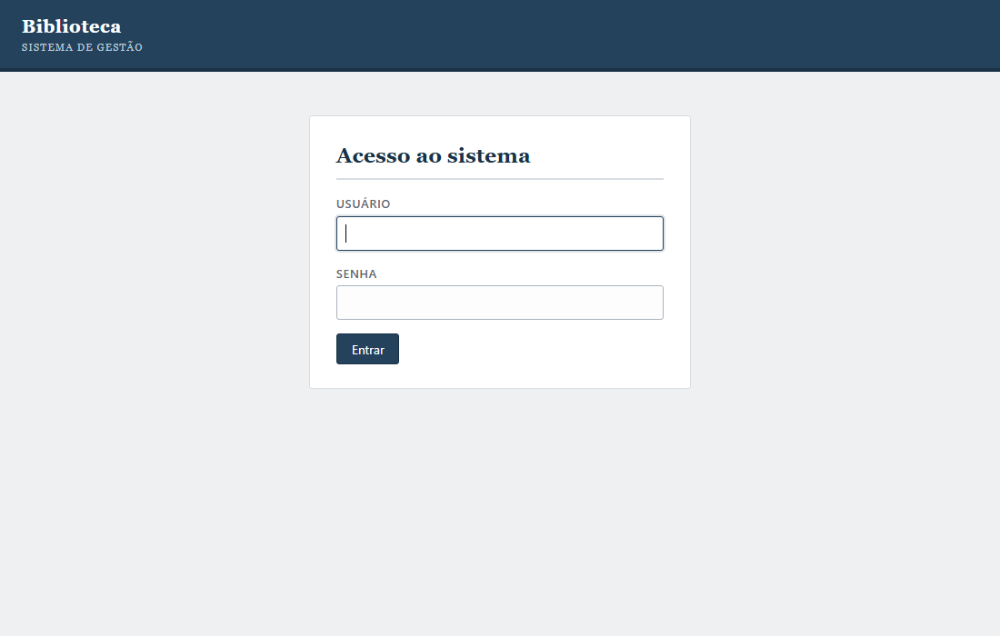
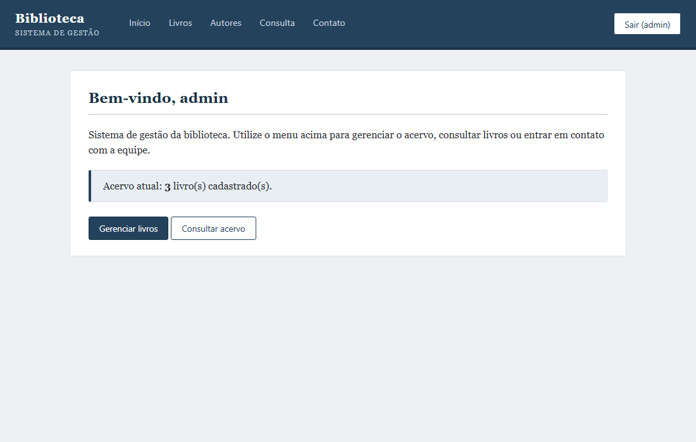
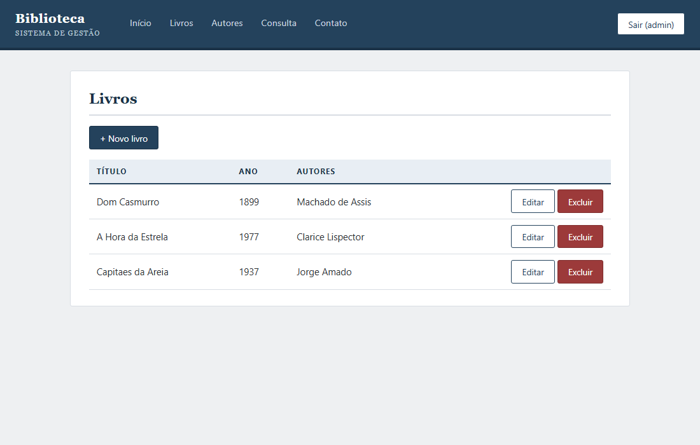
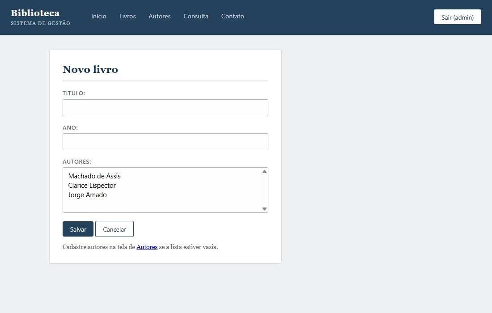
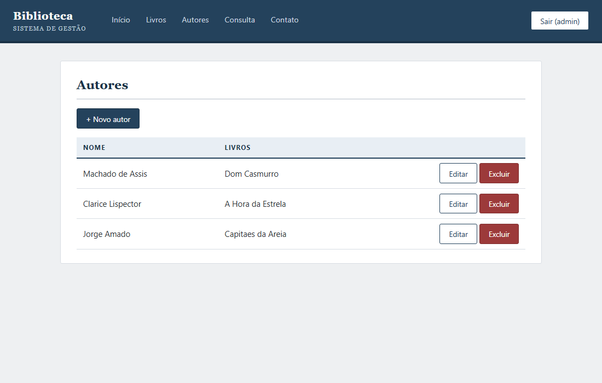
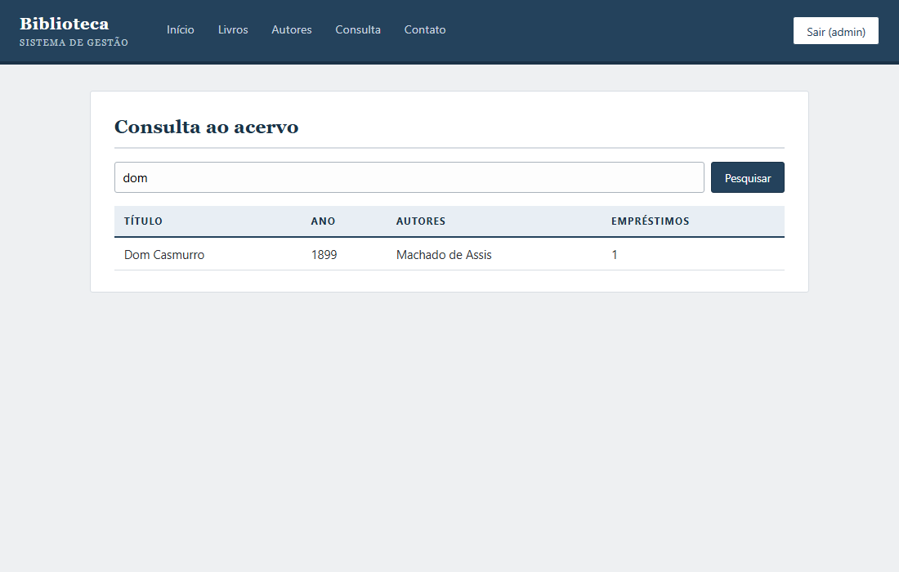
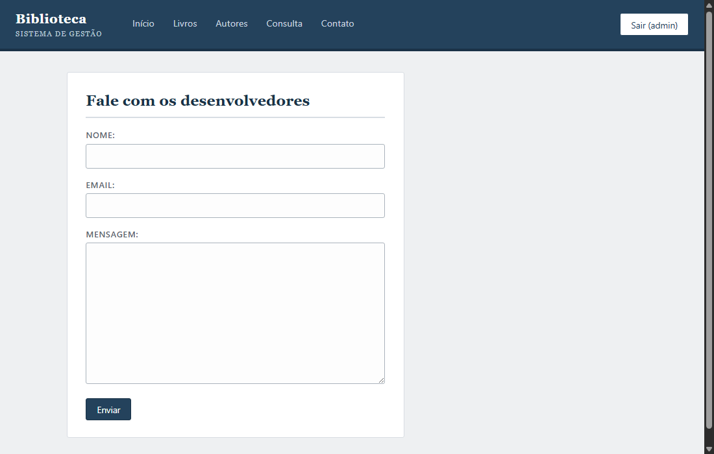

# Sistema de Gestão de Biblioteca

Projeto da disciplina de Práticas Extensionistas III.

## Integrantes

- Vinicios Andrei Mensen - 445509
- Vicenzo Henrique Peruzzo
- Jorge Luiz Lopes Polli - 369818
- João Vitor Chüler Battistella - 447607
- Vinicius Dalpasquale - 412017
- Joao Fernando Piovezan - 377015
- Léo Bauer

## Sobre o projeto

**Introdução:**
As novas tecnologias mudaram a forma como as pessoas acessam informação, fazendo com que bibliotecas se adaptem a um público mais digital e exigente, que busca praticidade e personalização. Nesse contexto, as bibliotecas passam a usar tecnologia e novas formas de comunicação para atrair e engajar usuários, deixando de ser apenas espaços físicos e se tornando ambientes mais interativos e acessíveis.

**Objetivo:**
O estudo tem como objetivo analisar como uma biblioteca utiliza estratégias para atrair e manter seus usuários.

**Metodologia:**
Trata-se de uma pesquisa exploratória, com abordagem qualitativa, realizada por meio de observação, entrevistas e análise de documentos da biblioteca.

**Resultados:**
Observou-se que a biblioteca busca se comunicar melhor com seus usuários, oferecendo conteúdos e serviços alinhados aos seus interesses. No entanto, há dificuldades em atender diferentes perfis de público e em entender completamente a experiência do usuário ao longo do uso dos serviços.

**Conclusão:**
Conclui-se que as estratégias adotadas ajudam na aproximação com o público, mas é importante melhorar o entendimento da jornada do usuário para oferecer serviços mais eficientes e adequados.

**Palavras-chave:**
Biblioteca. Usuários. Tecnologia. Comunicação. Experiência.

## O sistema

Protótipo funcional (MVP) de um sistema web de gestão de biblioteca, desenvolvido em **Python** com o framework **Django** e banco de dados **SQLite**. O sistema permite gerenciar o acervo de livros e autores, consultar o acervo e registrar mensagens de contato com os desenvolvedores. O acesso às telas de gestão exige autenticação.

### Funcionalidades

| Funcionalidade | Rota | Descrição |
|---|---|---|
| Login | `/login/` | Autenticação de acesso ao sistema |
| Interface principal | `/` | Tela inicial com resumo do acervo |
| CRUD de Livros | `/livros/` | Cadastrar, listar, editar e excluir livros |
| CRUD de Autores | `/autores/` | Cadastrar, listar, editar e excluir autores |
| Consulta ao acervo | `/consulta/` | Pesquisa por título ou autor, com número de empréstimos |
| Contato | `/contato/` | Formulário de contato com os desenvolvedores |
| Painel administrativo | `/admin/` | Gestão de usuários (leitores), empréstimos e mensagens |

### Capturas de tela

**Login**



**Interface principal**



**CRUD de Livros**





**CRUD de Autores**



**Consulta ao acervo**



**Formulário de contato**



## Modelagem

O modelo relacional do banco de dados e os demais diagramas estruturais do projeto estão nas pastas numeradas do repositório:

| Artefato | Localização |
|---|---|
| Script SQL do banco | [0. Banco/banco.sql](0.%20Banco/banco.sql) |
| Modelo relacional | [1. Modelagem/Modelo.jpeg](1.%20Modelagem/Modelo.jpeg) |
| Diagrama de classes | [2. DiagramaClasses/DiagramaClasses.png](2.%20DiagramaClasses/DiagramaClasses.png) |
| Diagrama de casos de uso | [3. DiagramaCasoUsoGeral/DiagramaUsoGeral.png](3.%20DiagramaCasoUsoGeral/DiagramaUsoGeral.png) |
| Diagrama de sequência | [4. DiagramaSequencia/Diagrama_de_sequencia.png](4.%20DiagramaSequencia/Diagrama_de_sequencia.png) |
| Diagrama de atividades | [5. DiaramasAtividades/diagramaDeAtividade.png](5.%20DiaramasAtividades/diagramaDeAtividade.png) |

As entidades do banco (Usuario, Livro, Autor, Emprestimo e tabelas de relacionamento) estão implementadas como modelos do Django em [codigo/core/models.py](codigo/core/models.py), espelhando o script SQL.

## Código fonte

O código fonte do sistema está na pasta [codigo/](codigo/):

- `codigo/biblioteca/` - configuração do projeto Django
- `codigo/core/` - aplicação com modelos, views, templates e testes
- `codigo/core/tests.py` - testes automatizados das telas e do CRUD
- `codigo/db.sqlite3` - banco de dados já populado com dados de exemplo

## Como executar

Requisitos: Python 3.10+ e Django 5.2+.

```bash
cd codigo
pip install -r requirements.txt
python manage.py runserver
```

Acesse http://127.0.0.1:8000/ e entre com:

- Usuário: `admin`
- Senha: `admin123`

O banco de dados SQLite já vem populado com livros, autores e um empréstimo de exemplo. Para recriar o banco do zero:

```bash
python manage.py migrate
python manage.py createsuperuser
```

Para rodar os testes:

```bash
python manage.py test
```

## Tecnologias utilizadas

- Python 3
- Django 5.2
- SQLite
- HTML e CSS
